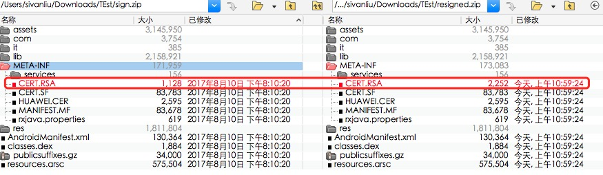
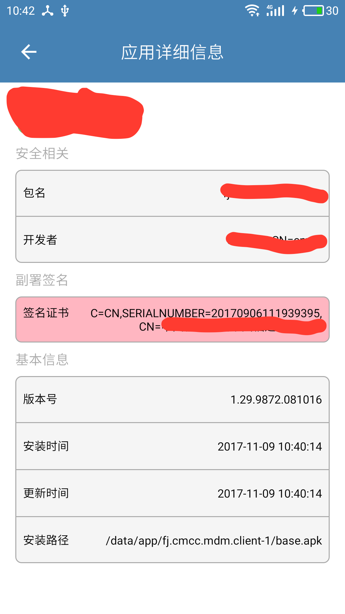

本篇主要分析副署签名的影响，主要包括安装、升级两个方面：  

### 1.分析对象：
- sign.apk 通过 apksigner 签名过的 apk；
- resigned.apk 为副署签名过的 apk；
- hack.apk 为模拟副署签名的 apk

### 2.所用工具：
- apksignar： https://developer.android.com/studio/command-line/apksigner.html
- keytool：https://docs.oracle.com/javase/6/docs/technotes/tools/solaris/keytool.html
- beyond compare：文件比对工具
- Trust Tracker：验证和追溯 Android 手机中已安装 APP 的副署签名工具 (http://apksign.syan.com.cn/?page_id=905)

### 3.sign.apk、resigned.apk 分析：

- 3.1 把 apk 看作 zip 文件，用 Beyond Compare 比较签名前后的 apk 文件内容的变化，看出只有 CERT.RSA 文件改变了：
    

- 3.2 用 apksignar 工具检验 sign.apk 和 resigned.apk 签名信息：    
    sign.apk 采用了 v1，v2 签名：
    

    resigned.apk 签名校验失败：
    

- 3.3 把 sign.apk 和 resigned.apk 后缀名改为 zip，用解压工具解压到，再用 keytool 命令查看 sign 和 resigned 目录中 META-INFO/CERT.RSA 信息：
    sign 目录中的 CERT.RSA 采用的签名证书 cmcc:
      

    resigned 目录中的 CERT.RSA 包括两个签名证书 cmcc 和 cmca：  
    

- 3.4 将 Trust Tracker.apk 和 sign.apk、resigned.apk 分别安装到手机中，打开 Trust Tracker 工具，在 “应用总览” 中找到已安装的 sign.apk、resigned.apk，点击查看应用详细信息，可以看出副署签名与 keytool 中的看到的证书2一致：
    - sign.apk 分析结果，可以看到其没有副署签名信息：
    
    
    - resigned.apk 可以检测出副署签名信息：  
    

### 4. 测试 sign.apk 和 resigned.apk 是否可以正常安装、升级：

- 4.1 安装：在 7.0 以下的系统可以正常安装，7.0 以上(包括 7.0)系统安装失败，无法安装，提示采用了 v2 签名，但没有证书；
    

- 4.2 升级：在 7.0 以下系统先安装 sign.apk，然后 adb 工具覆盖安装 resigned.apk，安装成功，说明对于 PackageManager#GET_SIGNATURES 的签名校验方式无影响，可以正常升级

#### 5.推测：
由 3、4 部分的分析、测试可以推断出 resigned.apk 采用的是副署签名的方式来增加签名，副署签名仅仅针对 apk 中 META-INFO 中的 CERT.RSA 文件作了修改，破坏了原有的 apk 文件，导致无法在 7.0 以上的系统正常安装

#### 6.验证推测：
为了验证 5 中的推测是否正确，模拟副署签名的步骤：
- 6.1 在 sign.apk 的基础上，利用 resigned.apk CERT.RSA 文件生成副署签名的 hack.apk：
    - 拷贝 signed.apk，重新命名为 hack.apk，修改其后缀名为 zip，直接解压；
    - 修改其后缀名为 zip，解压 resigned.apk 文件，用 META-INFO 中的 CERT.RSA 文件替换 hack 目录中的 CERT.RSA 文件；
    - 将 hack 目录中的所有文件重新压缩为 hack.zip，最后把后缀名 zip 修改为 apk

- 6.2 比较 hack.apk，比较 resigned.apk 和 hack.apk，重复 3.1 ~ 3.4 步骤：
    - Beyond Compare 比较结果，可看出两个 resigned.apk 和 hack.apk 相同：
    

    - 用 keytool 查看 hack.apk 的签名信息，可以看到与 resigned.apk 中签名信息一致：  
      
    
    - 通过 apksignar 查看 v1，v2 签名，可以看出与  resigned.apk 结果相同：  
      

    - 将 hack.apk 安装到手机中，在 Trust Tracker 应用总览中找到 hack.apk，点击查看 hack.apk 的应用详细信息；
    

- 6.3 测试 hack.apk 安装、升级：    
    - 在 7.0 以下系统可以正常安装，7.0(包括 7.0) 以上系统无法安装，错误提示与 4.1 中结果相同；
    
    
    - 将 sign.apk 安装到 7.0 以下的系统上，然后通过 adb 工具覆盖安装 hack.apk，安装成功，说明可以正常升级

- 6.4 由此可以断定 resigned.apk 是通过修改 CERT.RSA 文件的方式来增加了副署签名，破坏了原有的 sign.apk 中的 v2 签名，在 Android 7.0(包括 7.0) 以上系统安装的时候 v2 签名校验失败，导致安装失败。有关v1，v2 签名区别如下：
    - V1：仅仅验证未解压的文件内容，APK 签名后可进行许多修改 ，可以移动甚至重新压缩文件；

    - V2：该方案在原有的签名方案上，增加校验 APK 的 SHA256 哈希值；该签名机制，会对整个文件的每个字节都会做校验，包括 comment 区域。如果签名后对 APK 作了任何修改，在 Android 7.0(包括 7.0) 以上的机型安装时都会校验失败，提示没有签名无法安装。具体请参考:  https://source.android.com/security/apksigning/v2?hl=zh-cn

#### 6.结论：
若原有的 apk 签名没有采用 v2 方案，则仅修改 CERT.RSA 文件对 apk 的正常使用、升级没有明显影响；  
若原有的 apk 签名采用了 v2 方案，则对 apk 的任何修改都会破坏原有的 apk 的文件，导致在 7.0(包括 7.0) 以上系统安装的时候 v2 签名校验失败

副署签名风险：  副署签名会破坏原有的 apk 文件，存在无法正常安装使用的风险  

如有不当之处，请批评指正！谢谢！